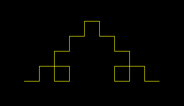
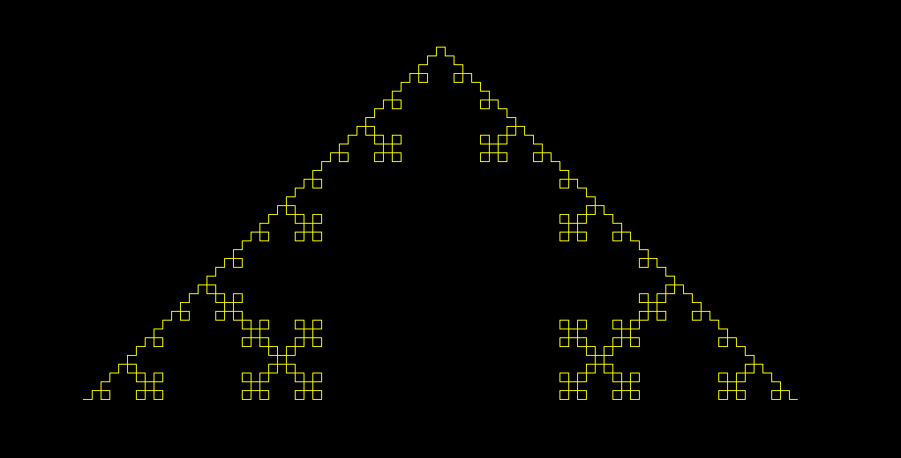
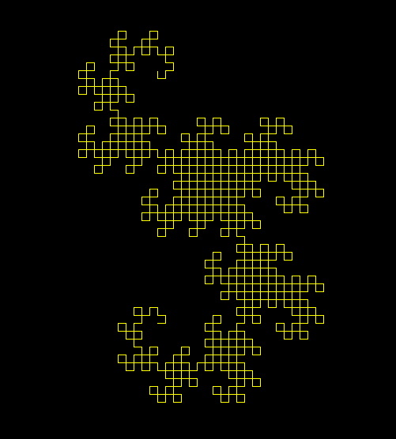
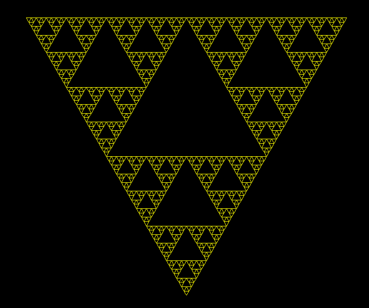
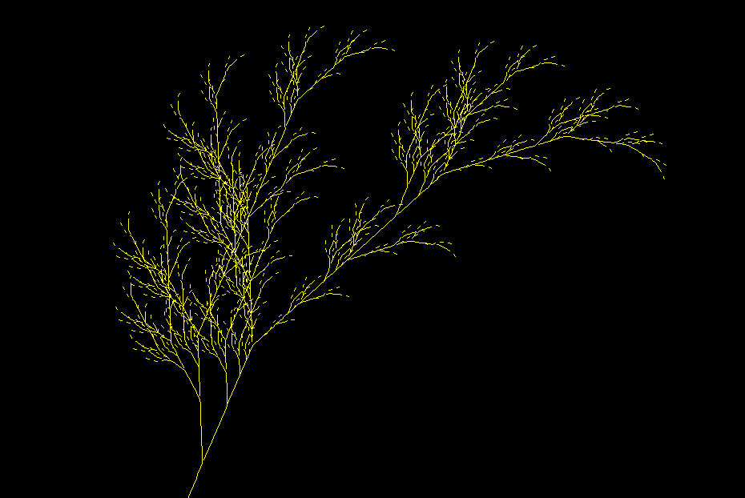

# `dat-lsys`

[L-System](https://jsantell.com/l-systems/) generator implemented in `Python3`.

## Installation

Clone the repo and run the `main.py` in `src` directory

```bash
git clone https://github.com/DatSudo/dat-lsys.git
cd dat-lsys/src
python main.py

# or
python3 main.py
```

## How it works

You need to have these three:
- **Alphabet/symbols.** Each symbol corresponds to some graphics movement such as "forward", "turn right", etc.
- **Axiom.** The initial state.
- **Rules.** Rules on how symbols will transform in each generation.

Example:
* **Symbols:** $F$, $+$, $-$
* **Axiom:** $F$
* **Rules:** $F \rightarrow F+F-F-F+F$

$$\begin{align*}
G=0 \rightarrow & F \\
G=1 \rightarrow & F+F−F−F+F \\
G=2 \rightarrow & F+F−F−F+\dots −F+F \\
\end{align*}$$

If we try to draw this with $F$ means "draw forward", $+$ means "turn left 90°", and $-$ means "turn right 90°":



At $G=4$:



### More examples:

Dragon Curve | Sierpinski Triangle | Fractal Plant
:-----------:|:-------------------:|:-------------:
 |  | 


## TODO
- [X] README
    - [X] Installation
    - [X] How it works
- [ ] GUI
- [ ] Documentation
- [ ] LICENSE
